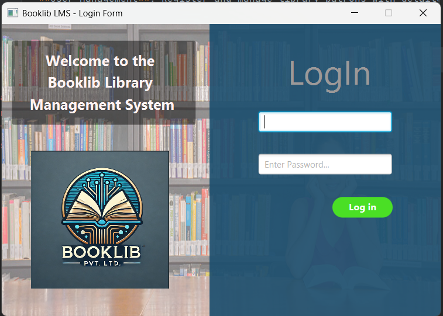
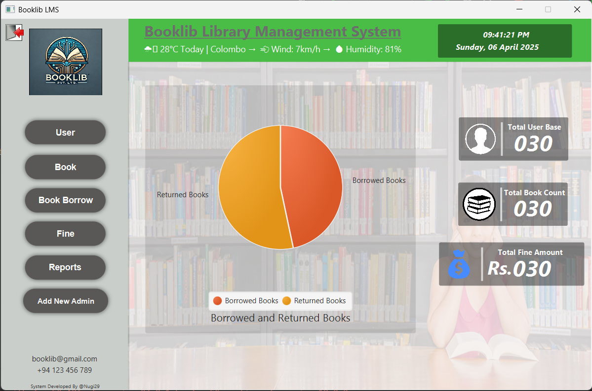
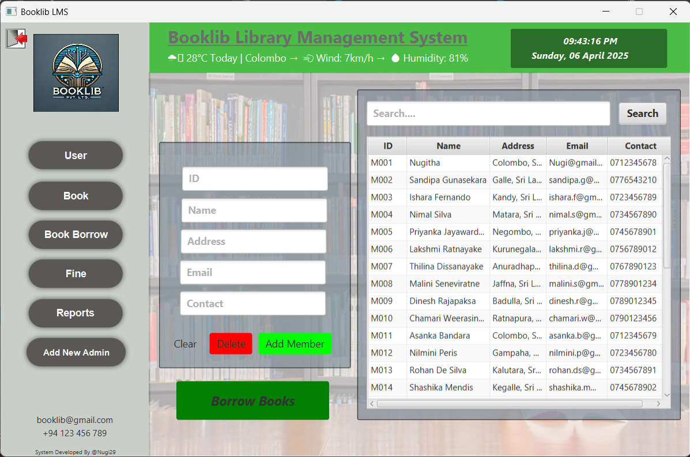
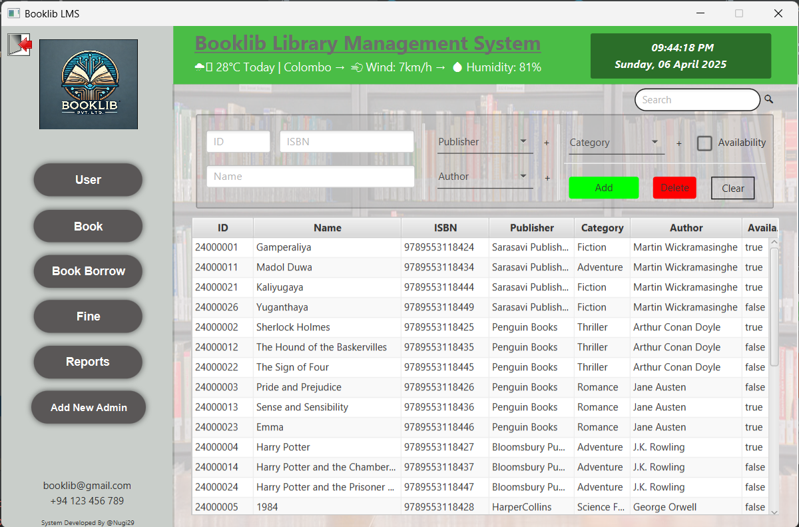
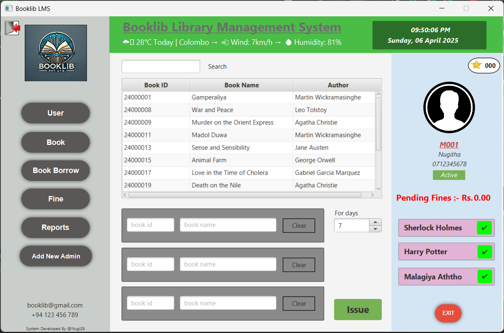
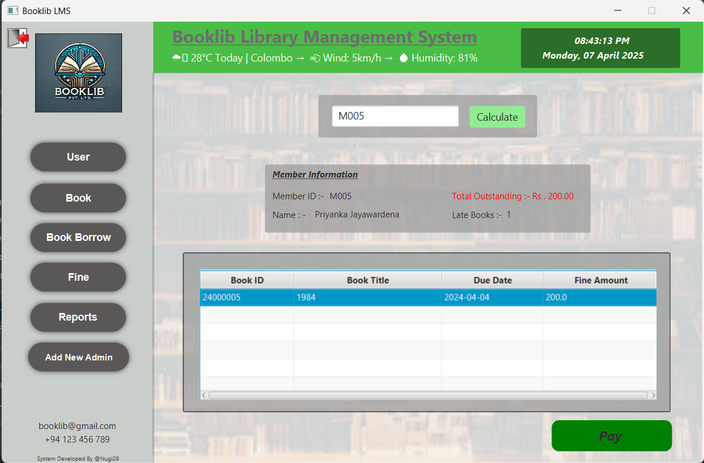
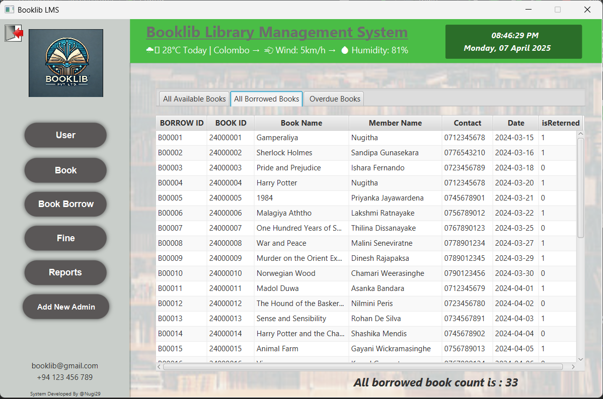
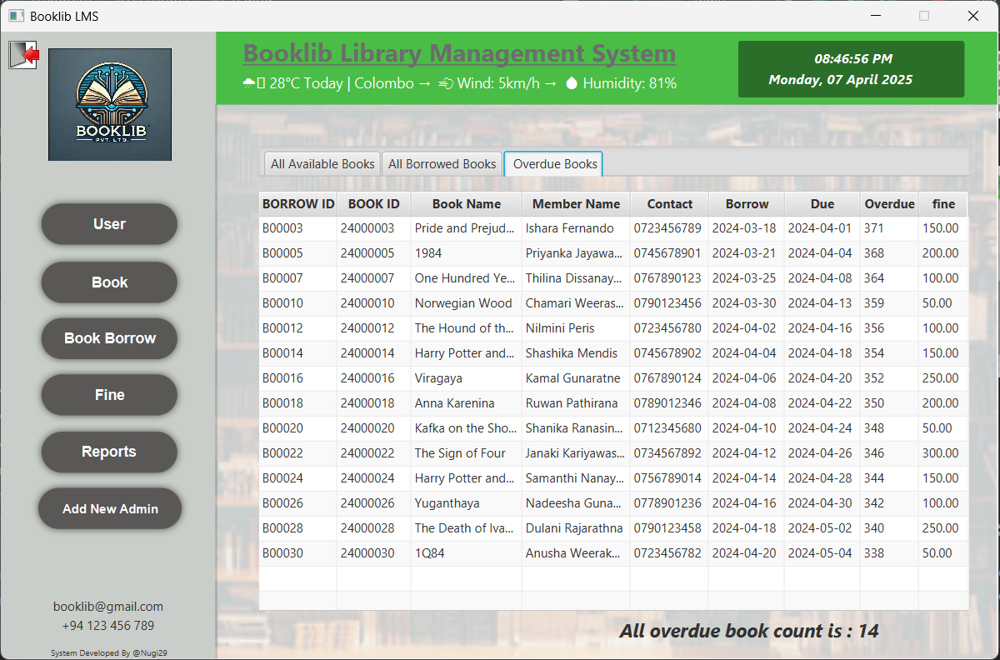

# BookLib Library Management System

<p align="center">
  
</p>

## 📚 Project Overview

BookLib Library Management System is a comprehensive JavaFX application developed for H.M. Sumathipala Liyanage's library in Rajagiriya. The system modernizes the traditional manual library operations, offering an efficient digital solution for book management, user registration, borrowing processes, and fine calculations.

### Key Features

- **Book Management**: Add, update, delete, and search books by various parameters
- **User Management**: Register and manage library patrons with detailed profiles
- **Borrowing System**: Track book checkouts, returns, and borrowing history
- **Fine Management**: Automatic calculation of overdue fines with payment tracking
- **Reporting**: Generate comprehensive reports on book availability, loans, and fines


🔐 Begin Your Journey
</div>
<p align="center">
  
  <br>
  <em>The gateway to efficient library management starts here</em>
</p>
<div align="center">
⚜️⚜️⚜️⚜️⚜️⚜️⚜️⚜️⚜️⚜️⚜️⚜️⚜️⚜️⚜️⚜️⚜️⚜️⚜️⚜️⚜️⚜️⚜️⚜️⚜️
</div>
<div align="center">
📊 Command Central
</div>
<p align="center">
  
  <br>
  <em>Your comprehensive overview of library operations and key metrics</em>
</p>
<div align="center">
🔖🔖🔖🔖🔖🔖🔖🔖🔖🔖🔖🔖🔖🔖🔖🔖🔖🔖🔖🔖🔖🔖🔖🔖🔖
</div>
<div align="center">
👥 Patron Management
</div>
<p align="center">
  
  <br>
  <em>Building relationships with readers through detailed member profiles</em>
</p>
<div align="center">
📚📚📚📚📚📚📚📚📚📚📚📚📚📚📚📚📚📚📚📚📚📚📚📚📚
</div>
<div align="center">
📖 Literary Collection
</div>
<p align="center">
  
  <br>
  <em>Curate and manage your growing treasury of knowledge</em>
</p>
<div align="center">
🏛️🏛️🏛️🏛️🏛️🏛️🏛️🏛️🏛️🏛️🏛️🏛️🏛️🏛️🏛️🏛️🏛️🏛️🏛️🏛️🏛️🏛️🏛️🏛️🏛️
</div>
<div align="center">
🔄 Circulation System
</div>
<p align="center">
  
  <br>
  <em>Secure patron verification ensures proper book circulation</em>
</p>
<p align="center">
  
  <br>
  <em>Seamless book checkout and return processing</em>
</p>
<div align="center">
💰💰💰💰💰💰💰💰💰💰💰💰💰💰💰💰💰💰💰💰💰💰💰💰💰
</div>
<div align="center">
💵 Financial Oversight
</div>
<p align="center">
  
  <br>
  <em>Transparent fine tracking and payment processing</em>
</p>
<div align="center">
📊📊📊📊📊📊📊📊📊📊📊📊📊📊📊📊📊📊📊📊📊📊📊📊📊
</div>
<div align="center">
📝 Analytical Insights
</div>
<p align="center">
  
  <br>
  <em>Comprehensive circulation metrics at your fingertips</em>
</p>
<p align="center">
  
  <br>
  <em>Deep dive into borrowing patterns and trends</em>
</p>
<p align="center">
  
  <br>
  <em>Strategic decision-making through powerful data visualization</em>
</p>
<div align="center">
🔑🔑🔑🔑🔑🔑🔑🔑🔑🔑🔑🔑🔑🔑🔑🔑🔑🔑🔑🔑🔑🔑🔑🔑🔑
</div>
<div align="center">
👤 Administrative Control
</div>
<p align="center">
  
  <br>
  <em>Secure system access with role-based administrator registration</em>
</p>
<div align="center">
✨✨✨✨✨✨✨✨✨✨✨✨✨✨✨✨✨✨✨✨✨✨✨✨✨
</div>


## 🛠️ Technologies Used

- **Frontend**: JavaFX with JFoenix for modern UI components
- **Backend**: Java
- **Standalone**: JavaFX
- **Database**: MySQL with direct JDBC connection
- **Build Tool**: Maven
- **Reports**: Custom report generation

## 📋 System Requirements

- Java 17 or higher
- MySQL 8.0 or higher
- Maven 3.8+

## ⚙️ Installation and Setup

1. **Clone the repository**
   ```bash
   https://github.com/Nugi29/Library_Management_Sys_FX.git
   cd Booklib_LMS
   ```

2. **Configure the database**
    - Create a MySQL database named `Booklib`
    - Update the database connection details in `Booklib_LMS/src/main/java/DB/DBConnection.java`

3. **Build the project**
   ```bash
   mvn clean install
   ```

4. **Run the application**
   ```bash
   mvn javafx:run
   ```

## 🏗️ Project Structure

Based on the screenshots provided, the project follows an MVC architecture:

```
booklib-lms/
├── src/
│   ├── main/
│   │   ├── java/
│   │   │   ├── controller/
│   │   │   │   ├── author/
│   │   │   │   ├── book/
│   │   │   │   ├── bookborrow/
│   │   │   │   ├── category/
│   │   │   │   ├── fine/
│   │   │   │   ├── member/
│   │   │   │   ├── publisher/
│   │   │   │   ├── report/
│   │   │   │   ├── DashboardController
│   │   │   │   ├── LoginFormController
│   │   │   │   └── RegisterFormController
│   │   │   ├── DB/
│   │   │   │   └── DBConnection
│   │   │   ├── model/
│   │   │   │   ├── reportModels/
│   │   │   │   ├── Admin
│   │   │   │   ├── Author
│   │   │   │   ├── Book
│   │   │   │   ├── BookBorrow
│   │   │   │   ├── Category
│   │   │   │   ├── Fine
│   │   │   │   ├── Member
│   │   │   │   └── Publisher
│   │   │   ├── WeatherService
│   │   │   ├── Main
│   │   │   └── Starter
│   │   └── resources/
│   │       ├── css/
│   │       ├── img/
│   │       └── view/
│   │           ├── authorform.fxml
│   │           ├── bookborrowform.fxml
│   │           ├── bookborrowloginform.fxml
│   │           ├── bookform.fxml
│   │           ├── categoryform.fxml
│   │           ├── dashboard.fxml
│   │           ├── fineform.fxml
│   │           ├── loginForm.fxml
│   │           ├── memberform.fxml
│   │           ├── publisherform.fxml
│   │           ├── RegNewAdmin.fxml
│   │           ├── reportform.fxml
│   │           └── userform.fxml
│   └── test/
└── pom.xml
```

## 📝 Usage Guide

### Book Management
- Navigate to the Book section to add, update, or delete books
- Use the search functionality to find books by title, author, or genre

### User Management
- Register new users with their details
- Manage existing user information and membership status

### Borrowing and Returning
- Process book borrowing and returns
- Set borrowing limits (3 books per user)
- Track return dates and automatically calculate overdue fines

### Fine Management
- View outstanding fines for users
- Process fine payments and update balances

### Reports
- Generate reports for available books, borrowed books, and overdue books with fines

### Weather Service Integration
- Real-time weather data displayed on the dashboard including temperature, location, wind, and humidity

## 👨‍💻 Development

This project was developed as part of the JavaFX project. It implements:

- CRUD operations for all entities (Books, Authors, Categories, Publishers, Members)
- Data validation and error handling
- Modern UI design with responsive layout
- Direct database interaction through JDBC
- Weather API integration for live weather data

## 🔮 Future Enhancements

- Email notifications for due dates and overdue books
- Online reservation system
- Integration with digital book repositories
- Mobile application for users
- QR code scanning for faster book checkout

---

<p align="center">Developed by @Nugi29</p>
